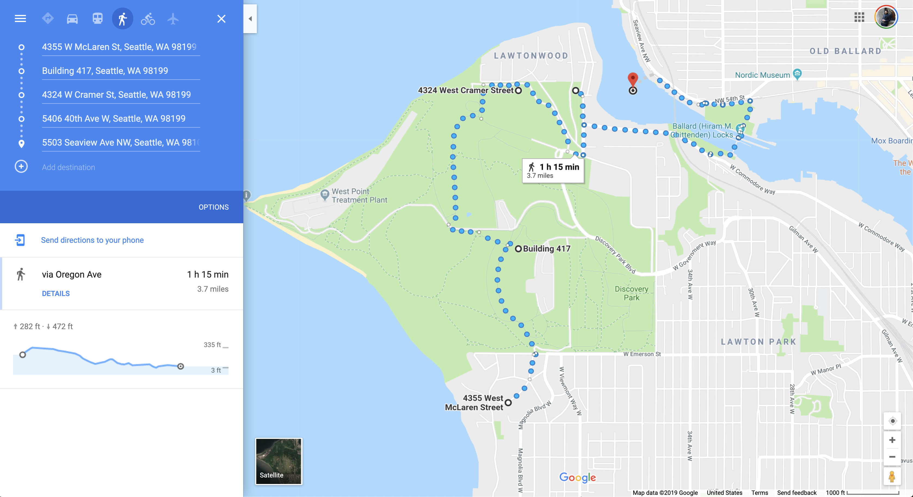

# Stroll

[](https://github.com/Brandoncyu/aechackathon2019) [](docs/)

TT AEC Hackathon 2019 - Seattle Project

This is the computational library which powers the Stroll App which helps people find the most nature-filled walks/paths to take thrughout the day in order to stimulate creativity and boost mental health.

Pathfinding is performed via Weighted Graph computation, with weights being given for characteristics such as proximity to parks, and amount of nature in the field of view.

## Proof of Concept

For the proof of concept application, we were not able to complete the functionality of a walk being a "loop", but we do calculate and find the most nature-filled walk given the input parameters and start point.



## Usage

### Imports

Imports can be done through the aggregating index.js file or via individual members.

```js
const Stroll = require('./index.js');
```

```js
const ColorParse = require('./ColorParse');
const StreetData = require('./StreetData');
const YelpData = require('./YelpData');
const WeatherData = require('./WeatherData');
const RouteData = require('./RouteData');
```

### Methods


#### Yelp Data

Yelp data for nearby public parks/green amenities.

```js
YelpData.ParkSearch(47.660273, -122.409887, 1000).then(d => {
  console.log(d);
});
```

#### Weather Data

Weather data analysis.

```js
let sunData = WeatherData.GetSunPositionToday(47.6694956, -122.31547389999999);
console.log(sunData);
```

#### Color Palette Analysis

Color palette analysis in field of view.

```js
ColorParse.GetPalette(46.414382, 10.013988, 151.78).then(colors => {
  console.log(colors);
});
```

```js
ColorParse.GetPaletteNames(46.414382, 10.013988).then(result => {
  console.log(result);
})
```

```js
ColorParse.GetPaletteAnalysis(47.660259, -122.408417).then(result => {
  console.log(result);
})
```

#### Pathfinding Data

Building graphs and calculating paths of travel.

```js
RouteData.GetGraphData(47.660273, -122.409887, 1, 0.5, 0.6).then(x => {
  console.log(x);
});
```

```js
RouteData.GetGraph(47.660273, -122.409887, 1, 0.5, 0.6).then(result => {
  console.log(result);
})
```

```js
RouteData.GetGraph(47.660273, -122.409887, 1, 0.5, 0.7).then(x => {
  let nodes = [];

  x.forEachLink(function (link) {
    console.log(link);
  });

  x.forEachNode(function (node) {
    nodes.push(node);
  });

  console.log(nodes);
})
```

```js
RouteData.FindNaturePaths(47.660273, -122.409887, 1, 0.5, 0.7).then(x => {
  console.log(x);
});
```

```js
RouteData.FindNaturePaths(47.660273, -122.409887, 1, 0.5, 0.7).then(x => {
  let result = RouteData.FindTopNaturePaths(x);
  console.log(result);
});
```
